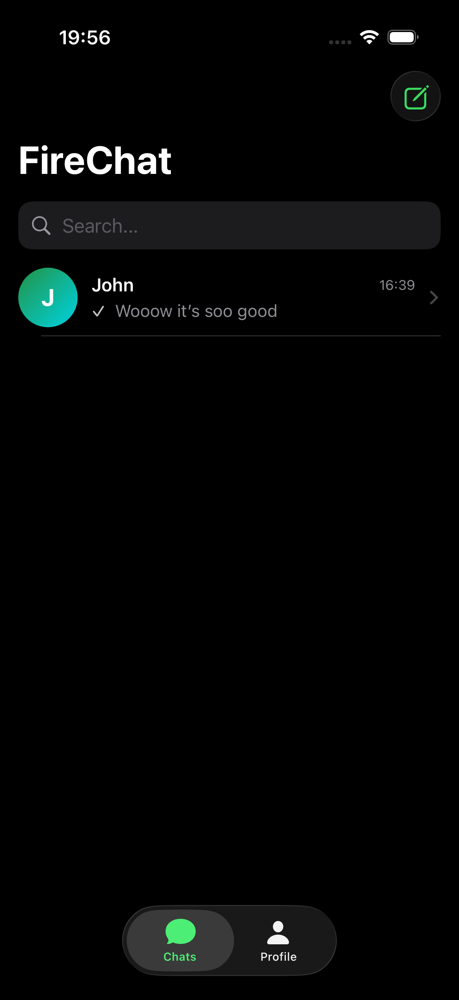
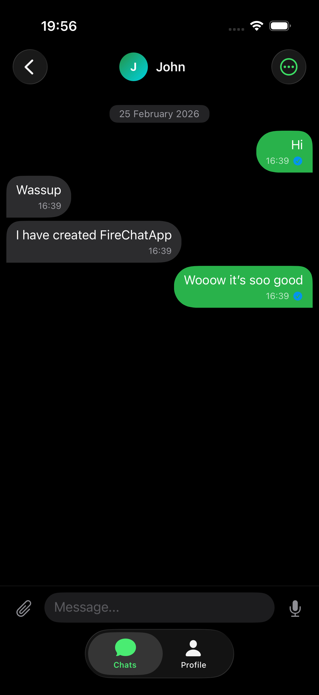
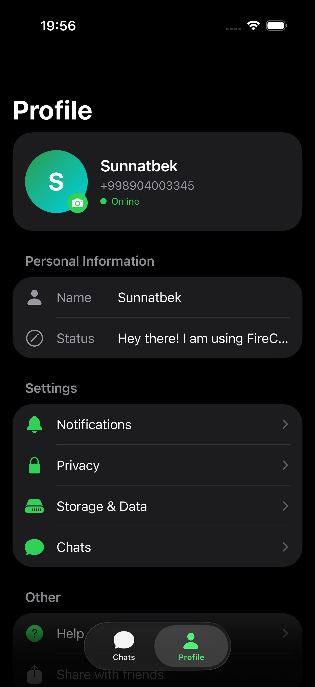

# FireChat – Real-Time Chat App (SwiftUI + Firebase)

<p align="center">
  
  
  
  
</p>

**FireChat** is a modern, real-time messaging application built entirely with **SwiftUI** and **Firebase** (Firestore + Authentication).  
It brings core WhatsApp-like features with a clean, minimal interface and efficient real-time synchronization.

**Current stage:** MVP – stable 1:1 messaging with media support.

## ✨ Features

- Email & password authentication
- Real-time private (1:1) chats
- Send **text**, **images**, **voice messages**, and **files**
- Media stored as **Base64** inside Firestore documents (no Firebase Storage used)
- Typing indicator
- Message statuses: sending → sent → delivered → read
- Reply to messages
- Delete messages (your own only)
- "Delete for me" chat history clearing
- Profile: name, status, avatar (Base64, ~80 KB max)
- Online / last seen with smart formatting ("today at 14:30", "yesterday", etc.)
- User search & new chat creation

## 📊 Current Limits (Firestore document size aware)

| Content        | Limit      | Notes                               |
| -------------- | ---------- | ----------------------------------- |
| Images         | 200 KB     | JPEG, auto-compressed               |
| Voice messages | 60 seconds | AAC (.m4a)                          |
| Files          | 700 KB     | PDF, DOC(X), XLS(X), TXT, ZIP, etc. |
| Profile photo  | ~80 KB     | Heavily compressed                  |

## 🛠 Tech Stack

- **SwiftUI** (iOS 16+)
- **Firebase Authentication** (Email/Password)
- **Cloud Firestore** + `FirebaseFirestoreSwift` (Codable models)
- **Combine** for reactive updates
- **AVFoundation** — audio recording & playback
- **PhotosUI** — image picker
- **UIDocumentPicker** — file picker

```
## 🚀 Quick Start

1. Create a Firebase project:  
   https://console.firebase.google.com

2. Enable **Authentication** → Email/Password  
   Create **Firestore Database** (start in production mode or test mode)

3. Download **GoogleService-Info.plist** and add it to the Xcode project root

4. Add Firebase SDK via **Swift Package Manager**:
```

[https://github.com/firebase/firebase-ios-sdk](https://github.com/firebase/firebase-ios-sdk)

text or via CocoaPods:

```ruby
pod 'Firebase/Auth'
pod 'Firebase/Firestore'
pod 'FirebaseFirestoreSwift'
```

Use the following Firestore rules for development (tighten for production):

``` firestore
rules_version = '2';
service cloud.firestore {
  match /databases/{database}/documents {
    match /{document=**} {
      allow read, write: if request.auth != null;
    }
  }
}
```

## 📱 Screenshots

## Screenshots

<p align="center">
  
  
  
</p>

<p align="center">
  <em>Left to right: Chats list • Active chat • Profile screen</em>
</p>

## 👨‍💻 Author

**Sunnatbek** 
Shirin, Uzbekistan Started: February 2026

